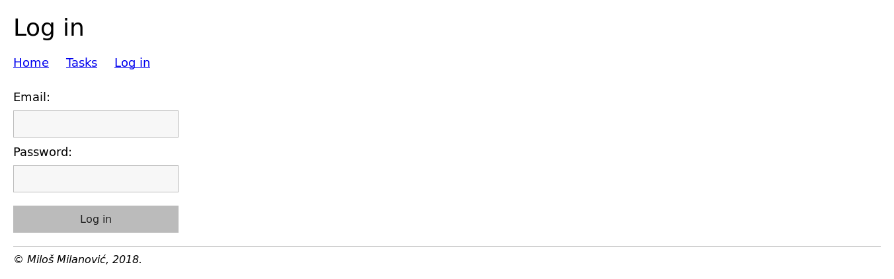
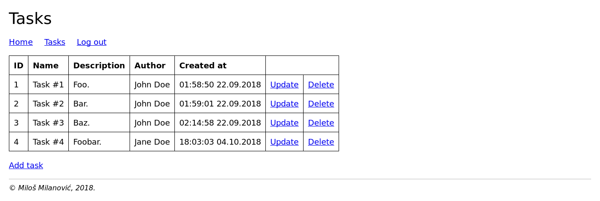

<p align="center">
	
</p>

# Overview

PHP MVC boilerplate with user authentication, basic security and MySQL CRUD operations.
Framework was developed during the final year of university. It was used for some private projects, however I highly suggest you to use Laravel or some other popular framework for your work.

## Requirements

- **Web server:** Apache with mod_rewrite enabled
- **Database server:** MySQL
- PHP 7.x

### Optional

- ApiGen / phpDocumentor
- PHPUnit

## Login operation

If you imported database data from `sys/db/dump.sql`, you could authenticate with following credentials:

- john.doe@example.com / admin
- jane.doe@example.com / admin

If you're manually adding user to `users` table, don't forget to append salt from `sys/Config.php` before hashing with SHA-512 algorithm.



## CRUD operations

Each database table should have appropriate model file. For example, table `tasks` have `app/models/TaskModel.php`. There you need to hardcode table name in protected `$tableName` property and eventually add new functions. Provided functions with basic model are:

- read
- readAll
- create
- update
- delete



## Router

All routes should be placed inside `routes.php`. Each route must have following properties:

- Name of the controller whom the route belongs to
- Name of the controller's method (the route callback)
- Request URI, represented via PCRE

For example, if we have following code:

```
...
new Route('Home', 'index', '|^/?$|'),
...
```

it means that when user visits URI which matched RegEx `|^/?$|`, `index.php` will instantiate `HomeController.php` and call his `index` method.

### RegEx cheat sheet

Route                    | Regex
:------------------------|:-------------------
`/`                      | \|^/?$\|
`users/`                 | \|^users/?$\|
`users/create/`          | \|^users/create/?$\|
`users/update/15/`       | \|^users/update/([0-9]+)/?$\|
`users/delete/4/`        | \|^users/delete/([0-9]+)/?$\|
`store/iphone-8-64gb/`   | \|^store/([a-z0-9]+(?:\\-[a-z0-9]+)*)/?$\|
Anything                 | \|^.*$\|

## Security

Framework provides basic security mechanisms.

### SQL injection

`Model` class uses prepared statements and `Database` class uses PDO's DSN charset parameter to set connection encoding to `utf8`. It is impossible for an attacker to inject malicious SQL this way. For providing defense in depth, you can use input validation - for applications that demand higher level of security, I use input validation not only in PHP, but in MySQL also (via triggers).

- [OWASP - SQL Injection Prevention Cheat Sheet](https://github.com/OWASP/CheatSheetSeries/blob/master/cheatsheets/SQL_Injection_Prevention_Cheat_Sheet.md)

### XSS

For basic XSS protection (e.g. when we need to insert data in HTML body) you can use `Security` class. For example, if we need to insert `$DATA['user']` in our HTML, we would use following code:

```
...
<p><?= Security::escape($DATA['user']); ?></p>
...
```

However, that wouldn't protect us if we needed to insert data inside `<script>` tag, for example. Visit OWASP page for further instructions. If you want to use third-party library for defense in depth, HTML Purifier is a good one. For API responses in JavaScript, don't forget to use safe JavaScript functions and properties (e.g. `element.textContent`, jQuery `.text()` function etc.) when you need to populate the DOM.

- [OWASP - XSS (Cross-Site Scripting) Prevention Cheat Sheet](https://github.com/OWASP/CheatSheetSeries/blob/master/cheatsheets/Cross_Site_Scripting_Prevention_Cheat_Sheet.md)

### Data exposure

This framework provides user authentication functionallity, however if you intend to use it, in order for your users to be protected, you need to use HTTPS (HTTP + SSL). Without SSL encryption anyone could intercept the transmission from your browser to the server. Today, this is completely free thanks to initiatives like Let's Encrypt CA. I highly advise that you use HTTPS-related mechanisms like HSTS and HPKP as well.

- [OWASP - User Privacy Protection Cheat Sheet](https://github.com/OWASP/CheatSheetSeries/blob/master/cheatsheets/User_Privacy_Protection_Cheat_Sheet.md)
- [Let's Encrypt CA](https://letsencrypt.org)

## Documentation

Great tool for generating documentation is [ApiGen](https://github.com/ApiGen/ApiGen). You can install it via Composer (I prefer doing it globally) and simply run:

```
apigen generate --source MVC --destination MVC/docs
firefox docs/index.html &
```

Due to the recent problems with ApiGen and PHP 7.2, I used [phpDocumentor](https://www.phpdoc.org/) as an alternative. Install phpDocumentor and run:

```
phpdoc --directory MVC --target MVC/docs
```
